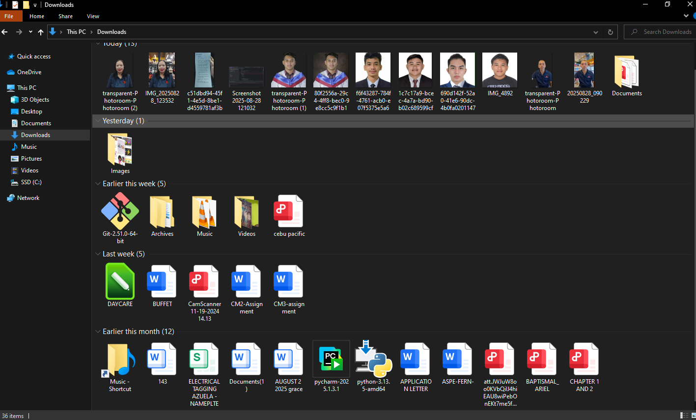
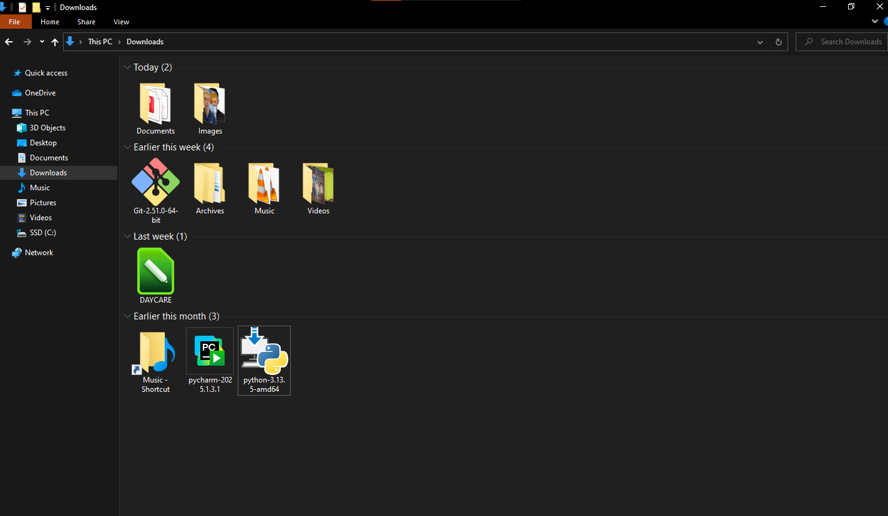
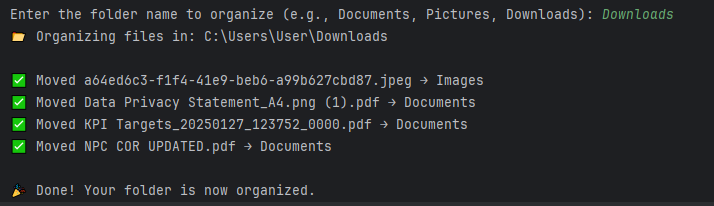

# File Organizer Bot

The **File Organizer Bot** is a Python automation tool that helps keep files neat and organized.  
Instead of manually moving files, this bot automatically sorts them into folders like **Documents, Images, Music, Videos, and Archives**.  

✅ Built to save time, reduce clutter, and make file management easier.  

---

## ✨ Features
- Automatically detects file types by extension  
- Moves files into categorized subfolders (e.g., `.pdf` → Documents, `.jpg` → Images)  
- Works on any folder specified by the user  
- Error-handling included if the folder is not found  

## 📌 Key Benefits
- Saves time from manual file organizing  
- Keeps work folders neat and professional  
- Easy to use — just enter the folder path  
- Can be customized for any client’s file type needs  

---

## 🛠️ Tools Used
- 
- Built-in libraries: `os`, `shutil`  

---

## 🚀 How to Use 
1. Clone or download this repository.  
2. Open the script in your IDE or run with Python.  
3. When prompted, enter the folder name you want to organize.  
   - Example: `Downloads` or `Desktop/Projects`  
4. The bot will automatically organize files into subfolders.
---

## 📂 Example Result
### Before:  

### After running: (All files are organized)

 

## 👨‍💻 About Me
Hi! I’m **Nef**, a Virtual Assistant skilled in automation and data handling.  
This is part of my **Automation Portfolio** to show how I can help clients save time through smart tools.